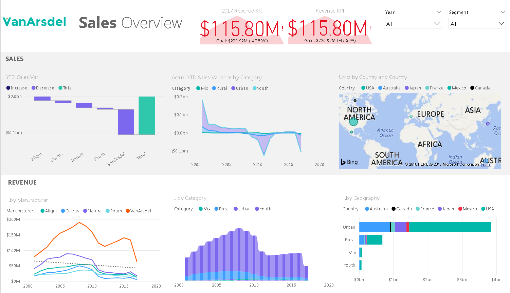
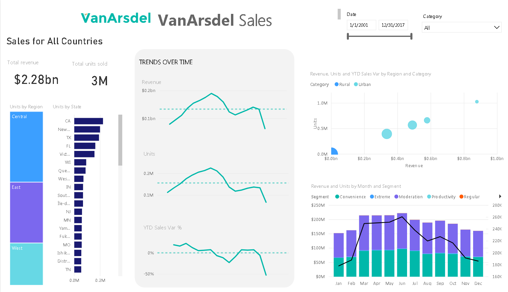
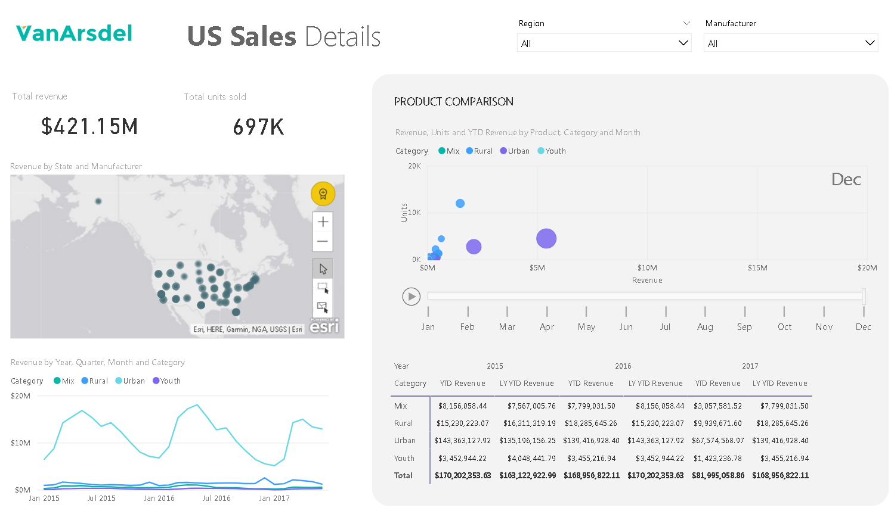

# PowerBI

### Van Arsdel Sales - Dashboard from scratch

I've being so enthusiastic about PowerBI, that I have followed each major release and enhancements. It wasn't until the past year (writing this as of May 2018), that I now feel PowerBI has surpased Tableau in features, functionality and ease of use.

I built this from scratch as a result of a 2 day training program at Microsoft.

Three views make up the entire dashboard.

